<h1 align="center">HackerVote</h1>
<h2>Introduction:</h2> HackerVote is an online voting web application. 
In which the guest user can vote for the best hacker among the hackers listed. 
Guest users are allowed to view the details of the listed hackers nd can vote for the hacker the hacker they deem best. However the guest user can only vote once. 
 
<h2>REQUIREMENTS:</h2> This project utilizes Python 3.8.2 and Django 3.0.8 at the backend and Use HTML5 and CSS3 at frontend.

<h2>WORKING:</h2> HackerVote homepage:
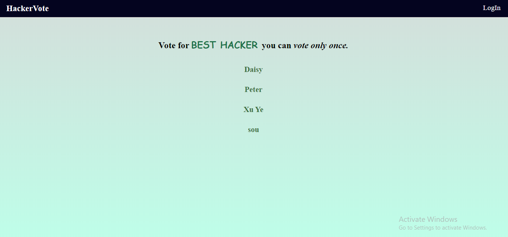
 
The guest user can select and hacker :
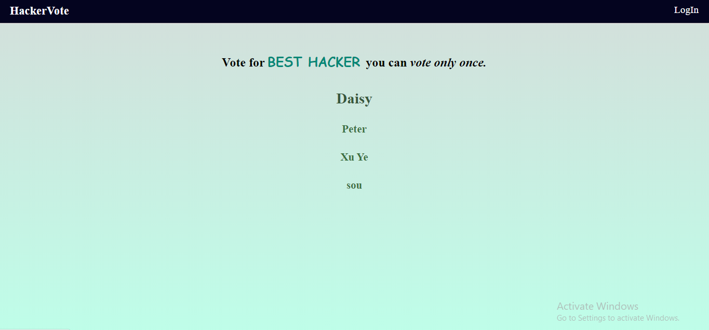
 
once clicked on the selected hacker, the details of the selected hacker can be seen:
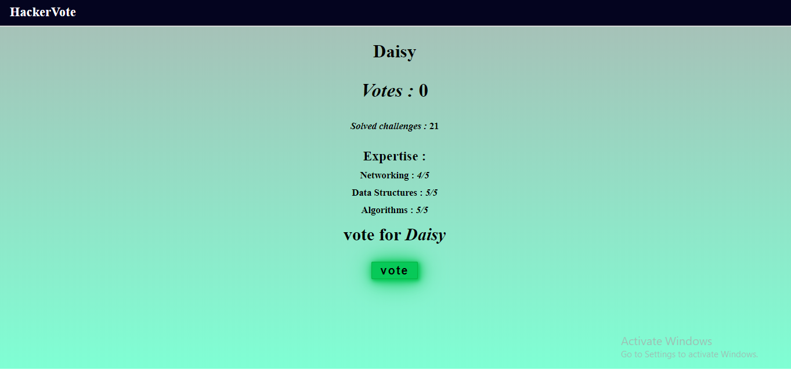
 
Guest user can vote for the hacker, if they want by clicking on the vote button, provided in the detail page of the given hacker:
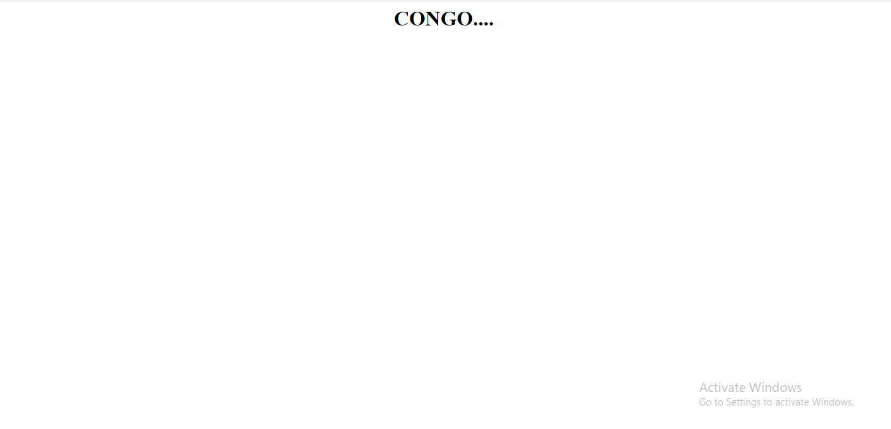
 
If voted once, the guest user tries to vote again for some other hacker, they won't be able to do so:
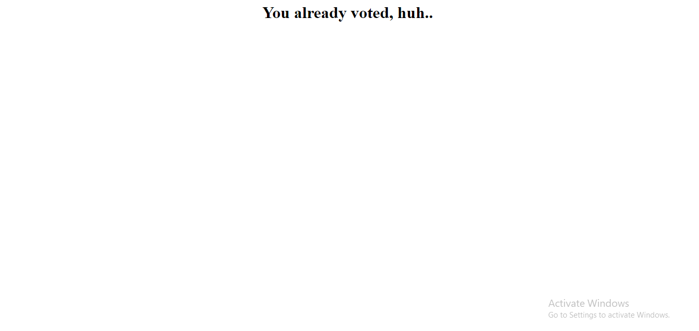
 
 
<h2>Admin:</h2> Admin can login using the login button provided, and see the following login form:
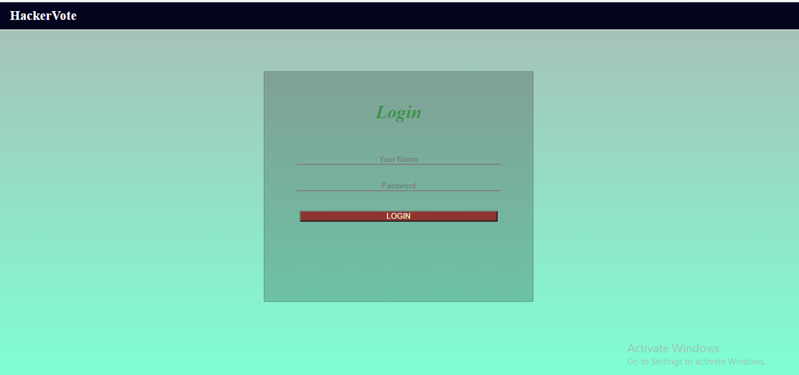
 
Once logged in admin sees the admin's dashboard page, where it can see all the candidate hackers, only admin can create, update or delete a particular candidate:
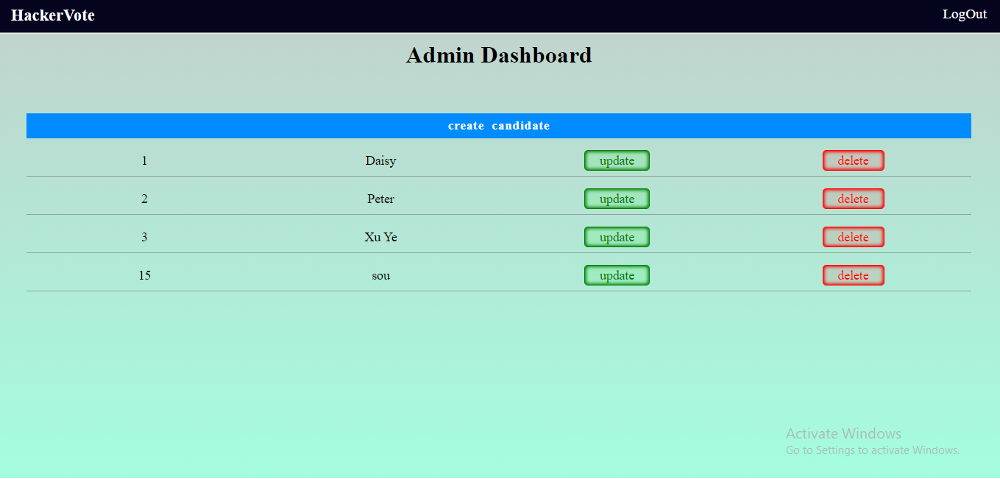
 
If admin want to create a new candidate, it can click on the button provided(create candidate) and sees the following form:
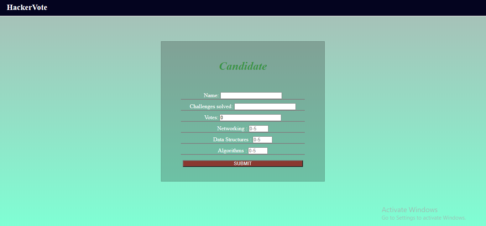
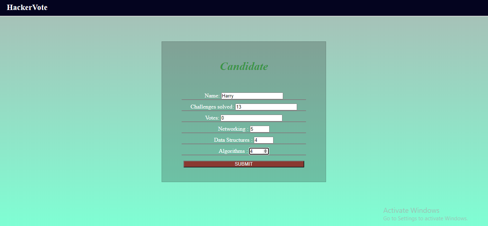
 
When admin clicks submit the following candidate will be created and the admin will be redirected to admin dashboard page:
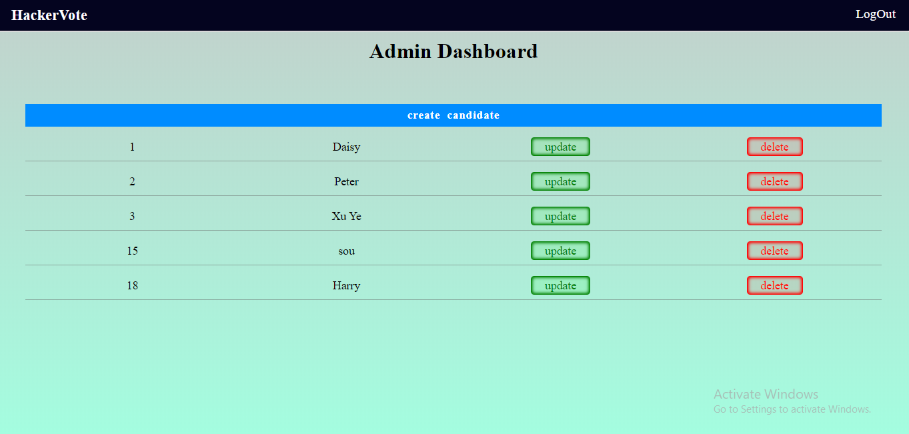
 
If the admin wants to update a candidate, it can do so by clicking on the update button provided for every candidate and sees the following form with candidates information already listed:

 
Once updated, the information of the candidate will be updated in the database and will be availabe for the guest user:
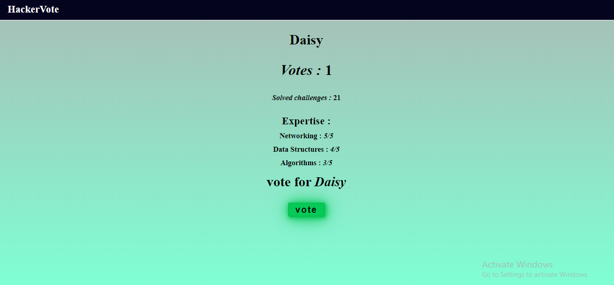
 
The admin can delete a particular candidate bu clicking on the delete button provided for every candidate and sees the following deletion confirmation page:

 
If selected on cancel, the deletion process terminates and redirects the admin to admin dashboard, and if delete is clicked, the particular user is deleted and the admin is redirected to the admin dashboard:

 
Admin can logout by clicking on the logout button provided, and will be redirected to the login form:
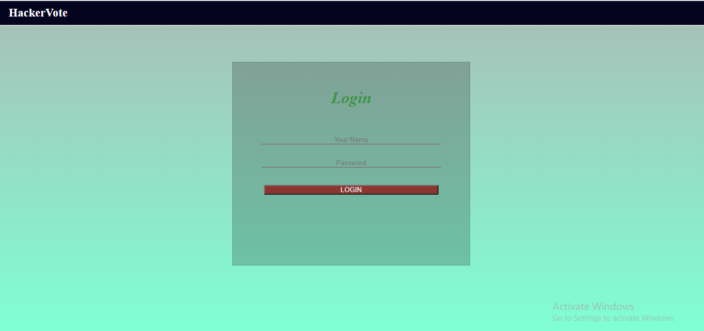
 
